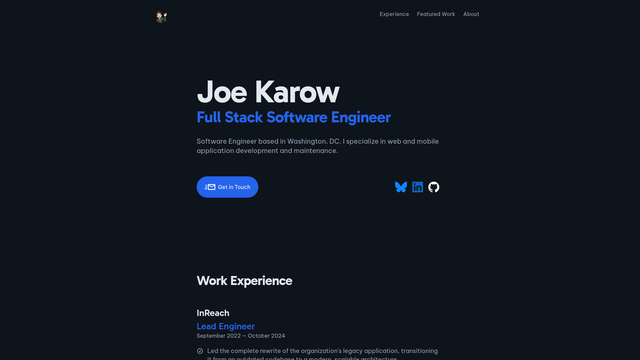

<!-- markdownlint-disable MD033 -->

# [JoeKarow.dev](https://joekarow.dev)

<div align='center'>



</div>

## Tech Stack

- [Astro 5](https://astro.build/)
- [Tailwind CSS v4](https://tailwindcss.com/)
- [TypeScript](https://www.typescriptlang.org/)
- [Vercel](https://vercel.com/) (hosting)

## Development

```sh
bun install     # Install dependencies
bun dev         # Start dev server
bun run build   # Type-check and build
bun run format  # Format with Prettier
bun run lint    # Check formatting and types
```
