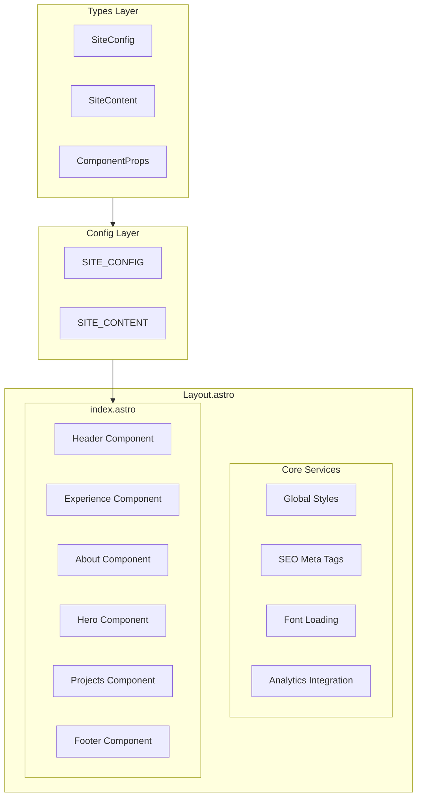
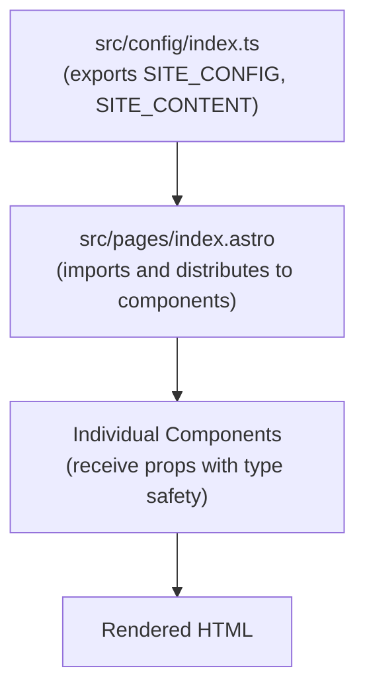
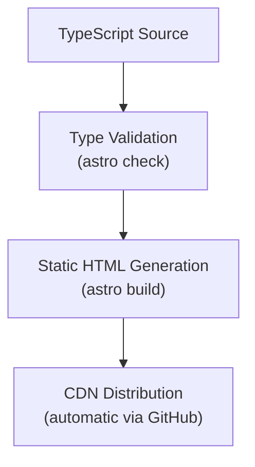

# Architecture Overview

## System Architecture

JoeKarow.dev follows a **static site generation** architecture with Astro's component-based system, emphasizing performance, type safety, and maintainability.

### High-Level Component Diagram



### Core Abstractions

#### 1. Configuration System
- **SITE_CONFIG**: Central configuration object containing site metadata, navigation, and social links
- **SITE_CONTENT**: Dynamic content structure for sections that may change
- **Type Safety**: All configuration backed by TypeScript interfaces

#### 2. Component System
- **Layout.astro**: Root wrapper providing SEO, fonts, and analytics
- **Section Components**: Modular, reusable components for content areas
- **Icon Components**: Dedicated icon system using astro-iconify
- **Props Interfaces**: Every component has typed props for safety

#### 3. Asset Management
- **Fonts**: @fontsource packages for consistent typography
- **Icons**: astro-iconify for scalable icon system
- **Images**: Optimized static assets in public directory
- **Styles**: Tailwind CSS with custom utilities

## Data Flow

### Configuration → Component Flow


### Build Process Flow


## API Surface

### Public Interfaces

#### Core Configuration Types
```typescript
// src/types/index.ts:0-8
interface SiteConfig extends HeaderProps {
    title: string
    description: string
    lang: string
    author: string
    socialLinks: SocialLinksProps[]
    socialImage: string
    canonicalURL?: string
}
```

#### Component Props
- **HeaderProps**: Navigation and branding
- **HeroProps**: Landing section content
- **AboutProps**: Personal information structure
- **ExperienceProps**: Professional experience data
- **ProjectProps**: Portfolio project structure
- **SocialLinksProps**: Social media links

### Entry Points

#### Primary Route
- **src/pages/index.astro**: Main homepage route that orchestrates all components

#### Layout System
- **src/layouts/Layout.astro**: Base layout with SEO, analytics, and global styles

#### Configuration
- **src/config/index.ts:1-32**: SITE_CONFIG constant with all site metadata
- **src/config/index.ts**: SITE_CONTENT with dynamic section content

## Integration Points

### External Services
- **Vercel Analytics**: Integrated in Layout.astro for usage tracking
- **Vercel Speed Insights**: Performance monitoring integration
- **Vercel Deployment**: Automatic deployment via GitHub integration and @astrojs/vercel adapter

### Development Tools
- **Bun Runtime**: Fast JavaScript execution and package management
- **TypeScript Compiler**: Strict type checking via astro check
- **Prettier**: Code formatting with Astro and Tailwind plugins
- **mise**: Development environment management

### Build System
- **Astro Build**: Static site generation with type checking
- **Tailwind CSS**: Compiled via Vite plugin integration
- **Font Optimization**: Automatic font loading and display optimization

## Performance Characteristics

### Static Generation Benefits
- **Zero Runtime JavaScript**: Components render to static HTML
- **Optimal Loading**: Pre-generated content served from CDN
- **SEO Friendly**: Full HTML available for crawlers
- **Fast Builds**: Incremental compilation with Astro

### Optimization Strategies
- **Component Islands**: Minimal JavaScript where needed
- **Font Display**: Optimized loading with fallback fonts
- **Image Optimization**: Responsive images with proper sizing
- **CSS Purging**: Unused Tailwind styles removed in production

This architecture provides a solid foundation for a high-performance, maintainable personal portfolio site with excellent developer experience through TypeScript and modern tooling.